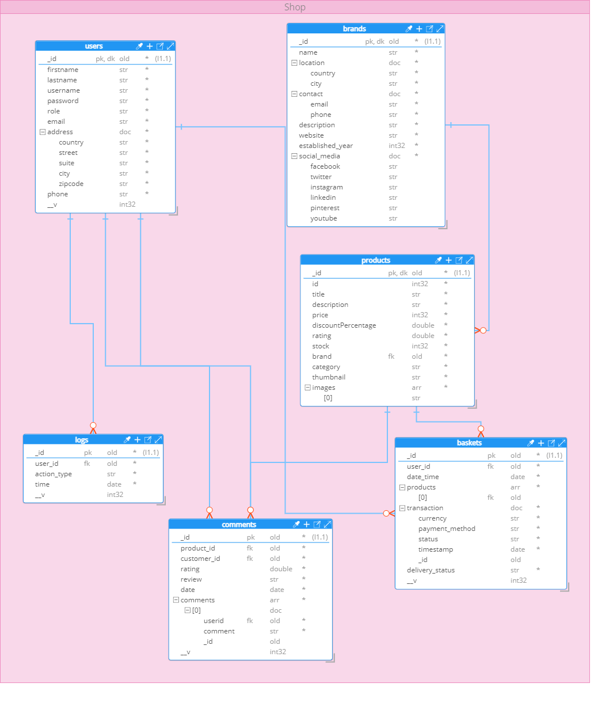
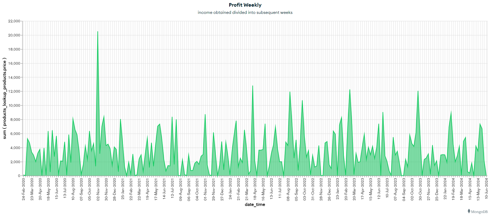
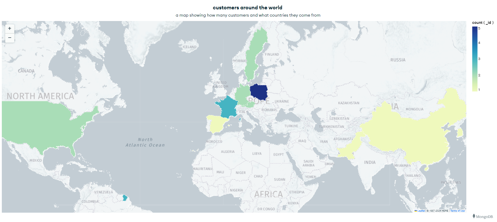
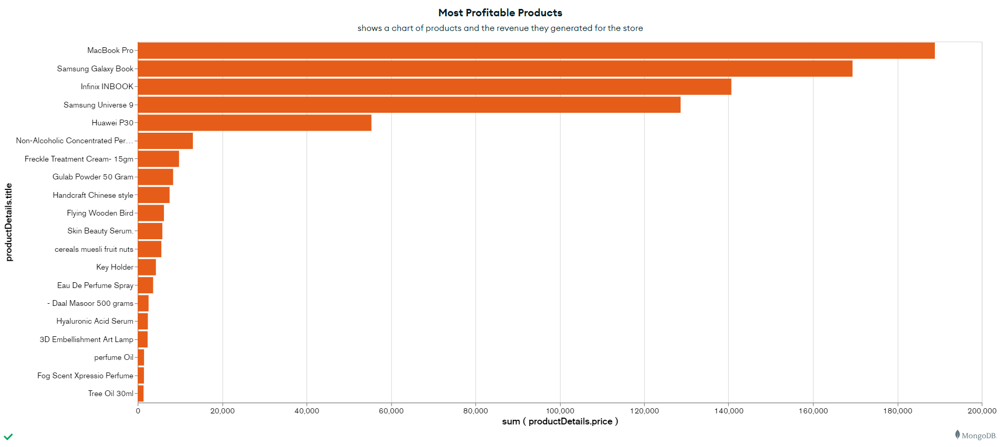
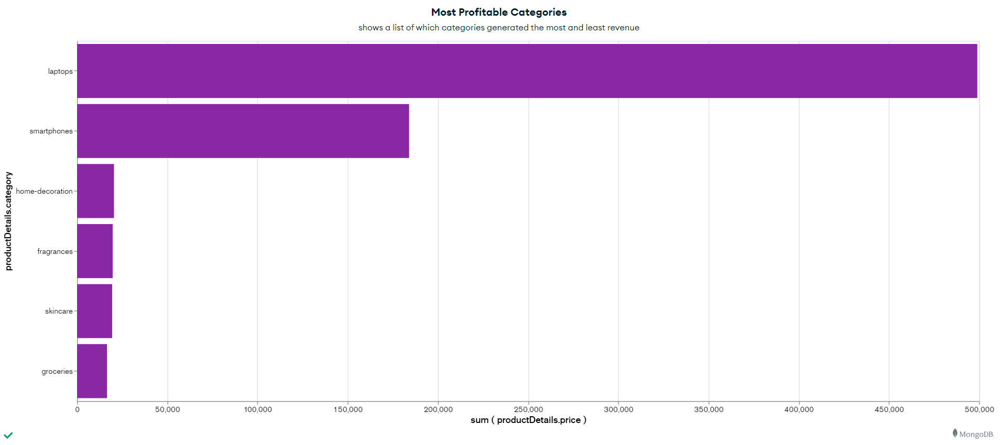
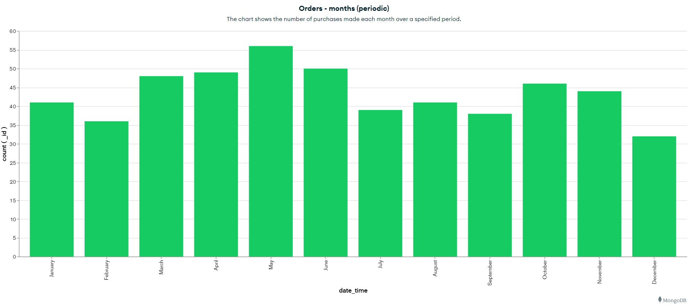
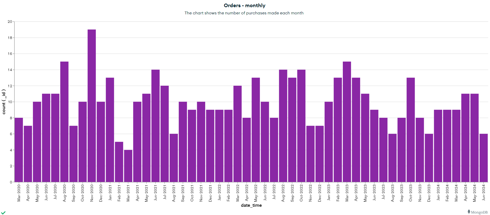
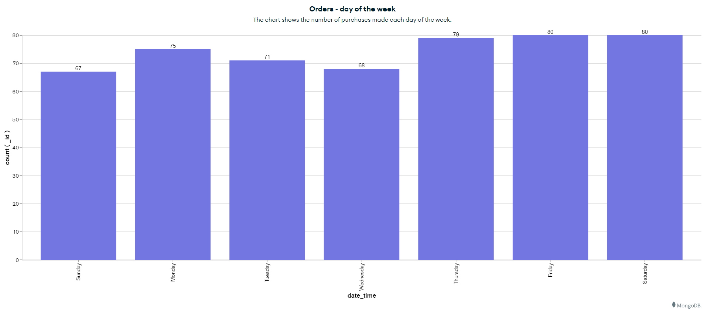
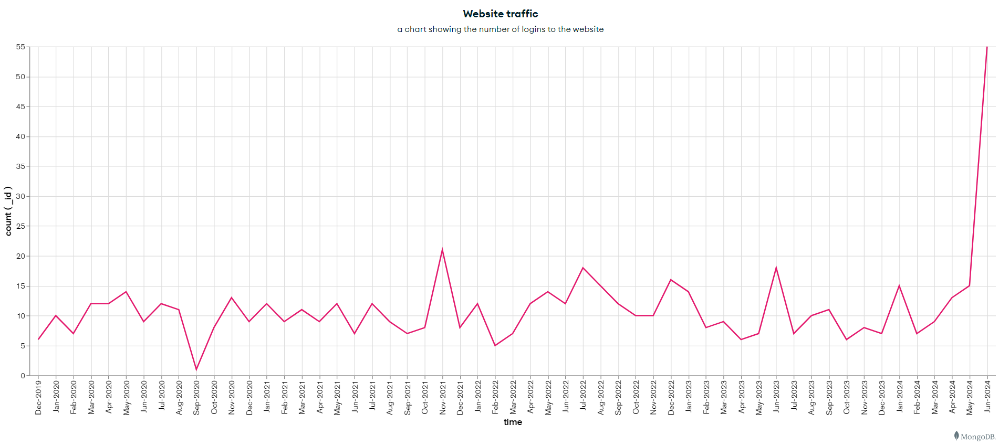

<h1>Bazy danych 2 - Projekt</h1>


## Temat: CRUD API sklepu internetowego

## Technologie:
- **Node.js -> Express**
- **MongoDB -> MongoDB Atlas + MongoDB Charts**


**oraz biblioteki:**
- **bcrypt** - Biblioteka pomagająca w haszowaniu haseł.
- **jsonwebtoken** - biblioteka służąca do tworzenia i weryfikacji tokenów sieciowych JSON (JWT).
- **moongose** - to narzędzie do modelowania obiektów MongoDB zaprojektowane do pracy w środowisku asynchronicznym. Mongoose obsługuje Node.js i Deno (alfa).
- **mongodb-js/charts-embed-dom** 
- **nodemailer** - biblioteka pomocna przy wysylaniu maili
- **mailgen** - biblioteka generujaca templatki do maili


**Wykonali:**

**Piotr Śmiałek** -  piotrsmia@student.agh.edu.pl
**Michał Tomaszewski** - mtomaszewski@student.agh.edu.pl


# Diagram

diagram wygenerowany przy pomocy narządzia Hackolade




# Kolekcje

## users
Zawiera inforamcje o użytkownikach sklepu internetowego


**przykładowy dokument:**
```js
{
  "_id": {
    "$oid": "661ee379a881e0b8999aabee"
  },
  "firstname": "Ervin",
  "lastname": "Howell",
  "username": "Antonette",
  "password": "$2b$10$ARZw9AcYC0cat.csewnl/eNbRf/LKKkxTFRLi0dDSJ7PlIgWqP7oW",
  "role": "customer",
  "email": "Shanna@melissa.tv",
  "address": {
    "country": "France",
    "street": "Victor Plains",
    "suite": "Suite 879",
    "city": "Wisokyburgh",
    "zipcode": "90566-7771"
  },
  "phone": "010-692-6593 x09125"
}
```
- **_id (objectId)** - klucz głowny
- **firstname (string)** - imie użytkownika 
- **lastname (string)** - nazwisko użytkownika 
- **username (string)** - nick użytkownika 
- **password (string)**  - zahaszowane hasło użytkownika
- **role (string enum)** - jedna z  dwóch ról obsługiwanych przez serwer (**customer** lub **admin** ), ma pomóc przy chronieniu dostęppu do niektórych endpointów
- **address (object)** - obiekt który trzyma pola typu string takie jak (**country**, **street**, **suite**, **city**, **zipcode**)
- **phone** - numer telefonu uzytkownika

**Validation rules - dla kolekcji users**

```js
{
  $jsonSchema: {
    additionalProperties: true,
    bsonType: 'object',
    required: [
      'firstname',
      'lastname',
      'username',
      'password',
      'email',
      'address',
      'phone'
    ],
    properties: {
      _id: {
        bsonType: 'objectId',
        description: 'must be an objectId and is required'
      },
      firstname: {
        bsonType: 'string',
        description: 'must be a string and is required'
      },
      lastname: {
        bsonType: 'string',
        description: 'must be a string and is required'
      },
      username: {
        bsonType: 'string',
        description: 'must be a string and is required'
      },
      email: {
        bsonType: 'string',
        description: 'must be a string and is required',
        pattern: '.*@.*'
      },
      password: {
        bsonType: 'string',
        description: 'must be a string and is required'
      },
      role: {
        'enum': [
          'user',
          'admin',
          'customer'
        ],
        description: 'it must be user or admin'
      },
      address: {
        bsonType: 'object',
        required: [
          'country',
          'street',
          'city',
          'zipcode'
        ],
        properties: {
          country: {
            'enum': [
              'France',
              'Germany',
              'Austria',
              'Sweden',
              'South Korea',
              'China',
              'Saudi Arabia',
              'United States',
              'Pakistan',
              'Spain',
              'Vietnam',
              'Poland'
            ],
            description: 'must be a string and is required'
          },
          street: {
            bsonType: 'string',
            description: 'must be a string and is required'
          },
          suite: {
            bsonType: [
              'string',
              'null'
            ],
            description: 'must be a string or null'
          },
          city: {
            bsonType: 'string',
            description: 'must be a string and is required'
          },
          zipcode: {
            bsonType: 'string',
            description: 'must be a string and is required'
          }
        },
        description: 'must be an object with country, street, city, and zipcode fields'
      },
      phone: {
        bsonType: 'string',
        description: 'must be a string and is required'
      }
    }
  }
}
```

## products
Kolekcja zawiera wszsytkie produkty dostępne w sklepie


**przykładowy dokument:**
```js
{
  "_id": {
    "$oid": "661edcb6a881e0b8999aabcc"
  },
  "id": 6,
  "title": "MacBook Pro",
  "description": "MacBook Pro 2021 with mini-LED display may launch between September, November",
  "price": 1749,
  "discountPercentage": 11.02,
  "rating": 4.57,
  "stock": 83,
  "brand": {
    "$oid": "664e5eec1322d1e99418db6d"
  },
  "category": "laptops",
  "thumbnail": "https://cdn.dummyjson.com/product-images/6/thumbnail.png",
  "images": [
    "https://cdn.dummyjson.com/product-images/6/1.png",
    "https://cdn.dummyjson.com/product-images/6/2.jpg",
    "https://cdn.dummyjson.com/product-images/6/3.png",
    "https://cdn.dummyjson.com/product-images/6/4.jpg"
  ]
}

```
- **_id (objectId)** - klucz głowny
- **title (string)** - nazwa produktu 
- **description (string)** - krótki opis produktu 
- **price ([int, double])** - cena produktu
- **discountPercentage ([int, double])**  - % o jaki produkt jest przeceniony
- **rating ([int, double])** - raing produktu
- **stock (int)** - ilość produktów na stanie magazynu 
- **brand (objectId)** - klucz obcy marki (kolekcja brands) 
- **category (enum string)** - jedna ze zdefiniowanych kategorii

**pola nieobowiązkowe**
- **thumbnail** oraz **images** - linki do zdjęć produktów 


**Validation rules - dla kolekcji products**

```js

{
  $jsonSchema: {
    additionalProperties: true,
    bsonType: 'object',
    required: [
      'title',
      'description',
      'price',
      'discountPercentage',
      'rating',
      'stock',
      'brand',
      'category'
    ],
    properties: {
      _id: {
        bsonType: 'objectId',
        description: 'must be an objectId and is required'
      },
      id: {
        bsonType: 'int',
        description: 'must be an integer and is optional'
      },
      title: {
        bsonType: 'string',
        description: 'must be a string and is required'
      },
      description: {
        bsonType: 'string',
        description: 'must be a string and is required'
      },
      price: {
        bsonType: [
          'int',
          'double'
        ],
        description: 'must be an integer or a double and is required'
      },
      discountPercentage: {
        bsonType: [
          'int',
          'double'
        ],
        description: 'must be an integer or a double and is required'
      },
      rating: {
        bsonType: [
          'int',
          'double'
        ],
        description: 'must be an integer or a double and is required'
      },
      stock: {
        bsonType: 'int',
        description: 'must be an integer and is required'
      },
      brand: {
        bsonType: 'objectId',
        description: 'must be a string and is required'
      },
      category: {
        'enum': [
          'smartphones',
          'food',
          'laptops',
          'fragrances',
          'skincare',
          'groceries',
          'home-decoration',
          'Example Category'
        ],
        description: 'must be one of the enum values and is required'
      },
      thumbnail: {
        bsonType: 'string',
        description: 'must be a string and is optional'
      },
      images: {
        bsonType: 'array',
        items: {
          bsonType: 'string',
          description: 'each image must be a string'
        },
        description: 'must be an array of strings and is optional'
      }
    }
  }
}
```


## brands
Kolekcja zawiera wszystkie marki, których produkty są dostępne na stanie 


**przykładowy dokument:**
```js
{
  "_id": {
    "$oid": "664e5eec1322d1e99418db6d"
  },
  "name": "Apple",
  "location": {
    "country": "United States",
    "city": "Cupertino"
  },
  "contact": {
    "email": "contact@apple.com",
    "phone": "+1-800-275-2273"
  },
  "description": "Apple Inc. designs, manufactures, and markets mobile communication and media devices, personal computers, and portable digital music players.",
  "website": "https://www.apple.com",
  "established_year": 1976,
  "social_media": {
    "facebook": "https://www.facebook.com/Apple",
    "twitter": "https://twitter.com/Apple"
  }
}

```
- **_id (objectId)** - klucz głowny
- **name (string)** - nazwa marki
- **location (object)** - obiekt, zawierający dokłądy adres firmy
  - **country (string)** - kraj z jakiego pochodzi firma
  - **city (string)** - miasto, z którego pochodzi firma

- **contact (object)** - obiekt, zawierający kontakt do firmy
  - **email (string)** - email
  - **phone (string)** -numer telefonu

- **description (string)** - krótki opis marki 
- **website (string)** - strona internetowa firmy
- **established_year (int)** - data powstania marki
- **social_media (object)** - media społecznościowe marki, gdzie mozna ją znaleźć
  - **facebook (string)**
  - **twitter (string)**
  - **linkedin (string)**
  - **youtube (string)**


**Validation rules - dla kolekcji products**

```js
{
  $jsonSchema: {
    additionalProperties: true,
    bsonType: 'object',
    required: [
      'name',
      'location',
      'contact',
      'description',
      'established_year'
    ],
    properties: {
      _id: {
        bsonType: 'objectId',
        description: 'must be an objectId and is required'
      },
      name: {
        bsonType: 'string',
        description: 'must be a string and is required'
      },
      location: {
        bsonType: 'object',
        required: [
          'country',
          'city'
        ],
        properties: {
          country: {
            'enum': [
              'France',
              'Germany',
              'Austria',
              'Sweden',
              'South Korea',
              'China',
              'Saudi Arabia',
              'United States',
              'Pakistan',
              'Spain',
              'Vietnam',
              'Poland'
            ],
            description: 'country must exist'
          },
          city: {
            bsonType: 'string',
            description: 'must be a string and is required'
          }
        },
        description: 'must be an object with country and city fields'
      },
      contact: {
        bsonType: 'object',
        required: [
          'email',
          'phone'
        ],
        properties: {
          email: {
            bsonType: 'string',
            description: 'must be a string and is required'
          },
          phone: {
            bsonType: 'string',
            description: 'must be a string and is required'
          }
        },
        description: 'must be an object with email and phone fields'
      },
      description: {
        bsonType: 'string',
        description: 'must be a string and is required'
      },
      website: {
        bsonType: 'string',
        description: 'must be a string'
      },
      established_year: {
        bsonType: 'int',
        description: 'must be an integer and is required'
      },
      social_media: {
        bsonType: 'object',
        properties: {
          facebook: {
            bsonType: 'string',
            description: 'must be a string'
          },
          twitter: {
            bsonType: 'string',
            description: 'must be a string'
          }
        },
        description: 'must be an object with optional facebook and twitter fields'
      }
    }
  }
}
```


## comments
Kolekcja zawiera komentarze i podkomentarze użytkoników do danych produktów

**przykładowy dokument:**
```js
{
  "_id": {
    "$oid": "665cc9700263fbb3b2f79b38"
  },
  "product_id": {
    "$oid": "661edcb6a881e0b8999aabe2"
  },
  "customer_id": {
    "$oid": "661ee379a881e0b8999aabee"
  },
  "rating": 2.5,
  "review": "Kupilem go ponownie i jakość znacząco spadla względem wcześniejszego zakupu",
  "date": {
    "$date": "2024-06-02T19:35:12.954Z"
  },
  "comments": [
    {
      "userid": {
        "$oid": "661ee379a881e0b8999aabed"
      },
      "comment": "NIe zgadzam sie z ta opinia, u wszystko jest w porzadku!!!",
      "_id": {
        "$oid": "665ccd5c01b697f932e229e0"
      }
    },
    {
      "userid": {
        "$oid": "661ee379a881e0b8999aabed"
      },
      "comment": "Zmieniam zdanie! Miał pan racje, produkt nie spelnia wymagan",
      "_id": {
        "$oid": "665ccdc9b44a40a6224935af"
      }
    }
  ],
  "__v": 2
}

```
- **_id (objectId)** - klucz głowny
- **product_id (objectId)**- id produktu do którego została wystawiona opinia
- **customer_id (objectId)**- id uzytkownika któy wystawił opinię główną
- **rating ([int, double])** - opinia w zakresie od 0 do 5 wystawiona produktowi 
- **review (string)** - komentarz do opinii
- **date (date)** -data wystawienia opinii
- **comments (array)** - lista obiektów (komentarze do opinii)
  w ramach jednego obiekti listy:
  - **userid (objectId)** - id użytkownika, który skomentował OPINIĘ
  - **comment (string)** - komentarz tego użytkownika

**Validation rules - dla kolekcji comments**

```js
{
  $jsonSchema: {
    additionalProperties: true,
    bsonType: 'object',
    required: [
      '_id',
      'product_id',
      'customer_id',
      'rating',
      'review',
      'date'
    ],
    properties: {
      _id: {
        bsonType: 'objectId',
        description: 'must be an objectId and is required'
      },
      product_id: {
        bsonType: 'objectId',
        description: 'must be an objectId and is required'
      },
      customer_id: {
        bsonType: 'objectId',
        description: 'must be an objectId and is required'
      },
      rating: {
        bsonType: [
          'int',
          'double'
        ],
        minimum: 1,
        maximum: 5,
        description: 'must be an integer between 1 and 5 and is required'
      },
      review: {
        bsonType: 'string',
        description: 'must be a string and is required'
      },
      date: {
        bsonType: 'date',
        description: 'must be a date and is required'
      },
      comments: {
        bsonType: 'array',
        items: {
          bsonType: 'object',
          required: [
            'userid',
            'comment'
          ],
          properties: {
            userid: {
              bsonType: 'objectId',
              description: 'must be an objectId and is required'
            },
            comment: {
              bsonType: 'string',
              description: 'must be a string and is required'
            }
          }
        },
        description: 'must be an array of objects containing userid and comment'
      }
    }
  }
}
```


## baskets
Koszyki z produktami użytkowników

**przykładowy dokument:**
```js
{
  "_id": {
    "$oid": "663fcf269d51de47edb6f0b5"
  },
  "user_id": {
    "$oid": "661ee379a881e0b8999aabee"
  },
  "date_time": {
    "$date": "2020-03-01T15:30:00.000Z"
  },
  "products": [
    {
      "$oid": "661edcb6a881e0b8999aabe4"
    },
    {
      "$oid": "661edcb6a881e0b8999aabd9"
    },
    {
      "$oid": "661edcb6a881e0b8999aabd5"
    }
  ],
  "transaction": {
    "currency": "PLN",
    "payment_method": "PayPal",
    "status": "in_progress",
    "timestamp": {
      "$date": "2023-05-01T15:30:00.000Z"
    }
  },
  "delivery_status": "order_placed"
}

```
- **_id (objectId)** - klucz głowny

- **user_id (objectId)**- id uzytkownika, który zamówił koszyk
- **date_time (date)** -data złożenia zamówienia
- **products (array of objectId's)** - lista z id'kami produktów, jakie zamówił klient
  - **product_id (objectId)**- id produktu (klucz obcy z kolekcji products)

- **transactiob (object)** - szczegóły transakcji
  - **currency (enum string)** - waluta w jakiej dokonał transakcji
  - **payment_method (enum string)** - sposób zapłacenia za zakupy
  - **status (enum string)** - status transakcji
  - **timestamp (date)** - data transakcji
- **delivery_status (enum string)** - status przesyłki 

**Validation rules - dla kolekcji comments**

```js
{
  $jsonSchema: {
    additionalProperties: true,
    bsonType: 'object',
    required: [
      '_id',
      'user_id',
      'date_time',
      'products',
      'transaction',
      'delivery_status'
    ],
    properties: {
      _id: {
        bsonType: 'objectId',
        description: 'must be an objectId and is required'
      },
      user_id: {
        bsonType: 'objectId',
        description: 'must be an objectId and is required'
      },
      date_time: {
        bsonType: 'date',
        description: 'must be a date and is required'
      },
      products: {
        bsonType: 'array',
        minItems: 1,
        items: {
          bsonType: 'objectId',
          description: 'each product must be an objectId'
        },
        description: 'must be an array of objectIds and is required'
      },
      transaction: {
        bsonType: 'object',
        required: [
          'currency',
          'payment_method',
          'status',
          'timestamp'
        ],
        properties: {
          currency: {
            'enum': [
              'PLN',
              'EUR',
              'USD'
            ],
            description: 'can only be one of the enum values and is required'
          },
          payment_method: {
            bsonType: 'string',
            description: 'must be a string and is required'
          },
          status: {
            'enum': [
              'rejected',
              'completed',
              'canceled',
              'in_progress'
            ],
            description: 'must be a string and is required'
          },
          timestamp: {
            bsonType: 'date',
            description: 'must be a date and is required'
          }
        },
        description: 'must be an object and is required'
      },
      delivery_status: {
        'enum': [
          'order_placed',
          'delivered',
          'on_the_way'
        ],
        description: 'must be \'order_placed\' and is required'
      }
    }
  }
}
```


## logs
kolekcja zawierająca proste informacje na temat logowania / wylogowywania się użytkowników ze strony sklepu 

**przykładowy dokument:**
```js
{
  "_id": {
    "$oid": "663fc5499d51de47edb6f022"
  },
  "user_id": {
    "$oid": "661ee379a881e0b8999aabed"
  },
  "action_type": "login",
  "time": {
    "$date": "2021-12-08T15:00:18.000Z"
  }
}

```
- **_id (objectId)** - klucz głowny

- **user_id (objectId)**- id uzytkownika, który zamówił koszyk
- **action_type (enum string)** - login / logout
- **time (date)** - czas i data akcji


**Validation rules - dla kolekcji comments**

```js
{
  $jsonSchema: {
    additionalProperties: true,
    bsonType: 'object',
    required: [
      'user_id',
      'action_type',
      'time'
    ],
    properties: {
      user_id: {
        bsonType: 'objectId',
        description: 'must be an objectId and is required'
      },
      action_type: {
        bsonType: 'string',
        'enum': [
          'login',
          'logout'
        ],
        description: 'must be one of the enum values (login/logout) and is required'
      },
      time: {
        bsonType: 'date',
        description: 'must be a date and is required'
      }
    }
  }
}
```

# Triggery

**UpdateProductrating**

- trigger aktualizuje rating produktu na podstawie wystawionych mu opinii. Odpala sie za każdym razem kiedy dodawany jest nowy dokument do kolekcji **comments**. Trigger zlicza średnia wartość ratingu w comments dla produktu, dla którego opinia została wytawiona i aktualizuję wartość w kolekcji products

```js
exports = async function(changeEvent) {
  const serviceName = "Cluster0"; 
  const databaseName = "Shop"; 
  const productsCollectionName = "products";
  const commentsCollectionName = "comments";

  const database = context.services.get(serviceName).db(databaseName);;
  if (!database) {
    console.error(`Database ${databaseName} not found.`);
    return;
  }

  const productsCollection = database.collection(productsCollectionName);
  const commentsCollection = database.collection(commentsCollectionName);
  
  
  if (changeEvent.operationType === "insert") {
    const fullDocument = changeEvent.fullDocument;

    const productId = fullDocument.product_id;
    
    console.log('productId ' + productId)

    try {
      const productComments = await commentsCollection.find({ "product_id": productId }).toArray();
      const totalRating = productComments.reduce((sum, comment) => sum + parseFloat(comment.rating), 0);
      const averageRating = parseFloat((totalRating / productComments.length).toFixed(2));
      console.log('totalRating ' + totalRating)
      console.log('averageRating ' + averageRating)
      
      await productsCollection.updateOne(
        { "_id":  productId  },
        { "$set": { "rating": averageRating } }
      );

      console.log(`Updated rating for product ${productId} to ${averageRating}`);
    } catch (err) {
      console.error(`Error updating rating for product ${productId}: ${err.message}`);
    }
  }
};

```


**MailSender**
- niestandardowy trigger, który uruchamia się kiedy admin aktualizuje procentowa zniżke na produkt w bazie danych (discountPercentage) - pod warunkiem, że ta procentowa znizka jest więszka lub równa 20%, wtedy wysyłana jest infoamcja z promocyjną ofertą do wszyskich użytkowników w bazie danych droga mailową

Enpoint aktualizujący produkt:
```js

productRoutes.post('/update-discount',authorization.authenticateToken, authorization.authorizeRoles([ROLES.ADMIN]), async (req, res) => {
  const { productId, discountPercentage } = req.body;

  try {
    const updatedProduct = await Product.findByIdAndUpdate(
      productId,
      { $set: { discountPercentage } },
      { new: true }
    );

    if (!updatedProduct) {
      return res.status(404).json({ message: 'Produkt nie znaleziony' });
    }

	if (discountPercentage >= 20 && updatedProduct) {
		await sendingMail(updatedProduct); 
	  }
  
    res.json(updatedProduct); 
  } catch (error) {
    console.error('Error updating product discount:', error);
    res.status(500).json({ message: 'Wystąpił błąd serwera podczas aktualizacji rabatu produktu' });
  }
});
```


Funcka wysyłjąca maile do użytkowników:

```js
async function mailSenderToAll(product) {
	try {    
	  let config = {
		service: 'gmail',
		auth: {
		  user: process.env.EMAIL,
		  pass: process.env.PASSWD 
		}
	  };
	  
	  let transporter = nodemailer.createTransport(config);
	  let mailGenerator = new Mailgen({
		theme: "default",
		product: {
		  name: "Mailgen",
		  link: 'https://mailgen.js/'
		}
	  });
	  
	  const users = await User.find({});
	  console.log(users);

	  const productImgHtml = (product.images && product.images.length > 0) ? `<br>` : '' 
	  console.log(productImgHtml)
	  for (let user of users) {
		let response = {
		  body: {
			name: `${user.firstname} ${user.lastname}`,
			intro: `We have a special offer for you on ${product.title}!`,
			table: {
			  data: [
				{
					item: product.title,
					description: product.description,
					price: product.price,
					discount: `${product.discountPercentage} %`
				}
			  ]
			},
			outro: `Looking forward to doing more business with you. ${productImgHtml}`,
		  }
		};
	
		let mail = mailGenerator.generate(response);
	
		let message = {
		  from: process.env.EMAIL,
		  to: user.email,
		  subject: "SPECIAL OFFER",
		  html: mail
		};
	
		const res = await transporter.sendMail(message);
		console.log(`Email sent to ${user.email}: ` + res.response);
	  }
	  
	} catch (err) {
	  console.log("Error performing email send: ", err.message);
	}
  }
```

# Logowanie


Każdy użytkownik w tabeli users posiada email i zahaszowane hasło. Do każdego użytkownika jest także przypisana rola, jest ich dwie: admin i customer. Większość endpointów na serwerze jest chrononych ( tylko niektóre są dostępne dla gości). 

Logowanie odbywa się przez endpoint:

**POST /login** w body podajemy password

```js
POST http://localhost:8000/login
Content-Type: application/json

{
  "email": "Julianne.OConner@kory.org",
  "password": "haslo123"
}
```

W odpowiedzi dostajemy token, którego używamy przy chronionych endpointach.

Logowanie jest realizowane przy pomocy jwt token'a, przy pomocy middleware.

```js
function authenticateToken(req, res, next){
		const authHeader = req.headers['authorization']
		// we split because its: BEARER <token>
		const token = authHeader && authHeader.split(' ')[1]
	
		if(token == null){
				res.status(400)
		}
		jwt.verify(token, process.env.ACCESS_TOKEN_SECRET, (err, user) =>{
			if(err) return res.sendStatus(403)
	
			req.user = user;
			next()
		})
	}
	
	function authorizeRoles(allowedRoles) {
		return (req, res, next) => {
			if (!allowedRoles.includes(req.user.user.role)) {
				return res.status(403).send('Access forbidden: insufficient rights');
			}
			next();
		}
	}
```

Endpoint realizujacy logowanie:

```js

authenticationRoutes.post('/login', async (req, res) => {
		try {
			const { email, password} = req.body;
			console.log(email)
			console.log(password)
			const user = await User.findOne({ email: email });
			if (user == null) {
				return res.status(400).send('Cannot find user with given email');
			}
	
			if (!await bcrypt.compare(password, user.password)) {
				return res.status(400).send('Wrong password');
			}
	
			const accessToken = jwt.sign(
				{ user : user },
				process.env.ACCESS_TOKEN_SECRET,
				{ expiresIn: '20m' }
			);
			
			console.log(new Date())

			const newLog = new Logs({
				user_id: user._id, 
				action_type: 'login',
				time: new Date()
			});
			

			const savedLog = await newLog.save();
			console.log(savedLog)
			res.status(201).json({ accessToken: accessToken });
		} catch (error) {
			console.error("Error during login:", error);
			res.status(500).send('An error occurred during login');
		}
	});
```


# Admin 

Endpointy do jakich ma dostęp Admin (dodatkowo ma dostęp do endpointów customera i guesta)

**GET /profit-weekly**

- zwraca listę dochodów z podziałem na tygodnie od początku działania sklepu internetowego z podziałem na tygodnie



- aggregation pipe:
```js
[
		{
		  "$match": {
			"transaction.status": { "$in": ["completed", "in_progress"] }
		  }
		},
		{
		  "$unwind": "$products"
		},
		{
		  "$lookup": {
			"from": "products",
			"localField": "products",
			"foreignField": "_id",
			"as": "productDetails"
		  }
		},
		{
		  "$unwind": "$productDetails"
		},
		{
		  "$project": {
			"week": { "$week": "$date_time" },
			"year": { "$year": "$date_time" },
			"price": "$productDetails.price",
			"discountPercentage": "$productDetails.discountPercentage",
			"finalPrice": {
			  "$multiply": [
				"$productDetails.price",
				{
				  "$subtract": [
					1,
					{
					  "$divide": [
						"$productDetails.discountPercentage",
						100
					  ]
					}
				  ]
				}
			  ]
			}
		  }
		},
		{
		  "$group": {
			"_id": { "year": "$year", "week": "$week" },
			"totalProfit": { "$sum": "$finalPrice" }
		  }
		},
		{
		  "$sort": { "_id.year": 1, "_id.week": 1 }
		},
		{
		  "$project": {
			"_id": 0,
			"year": "$_id.year",
			"week": "$_id.week",
			"totalProfit": 1
		  }
		}
	  ]
```


**GET /customers-around-world**
- zwraca zarejestrowanych użytkowników w danych krajach i interaktywna mapke, która mozna osadzić na forncie




**GET /most-profitable-products**

- zwraca listę produktów i przychód jakie one wygenerowały dla sklepu, lista jest posortowana od produktów, które wygenerowały najwięcej przychodu to tych, które wygenreowały najmniej



- aggregation pipe:
```js
[
		{
		  "$lookup": {
			"from": "products",
			"localField": "products",
			"foreignField": "_id",
			"as": "productDetails"
		  }
		},
		{
		  "$unwind": "$productDetails"
		},
		{
		  "$project": {
			"product_id": "$productDetails._id",
			"title": "$productDetails.title",
			"price": "$productDetails.price",
			"discountPercentage": "$productDetails.discountPercentage",
			"finalPrice": {
			  "$multiply": [
				"$productDetails.price",
				{
				  "$subtract": [
					1,
					{
					  "$divide": [
						"$productDetails.discountPercentage",
						100
					  ]
					}
				  ]
				}
			  ]
			}
		  }
		},
		{
		  "$group": {
			"_id": "$product_id",
			"title": { "$first": "$title" },
			"totalValue": { "$sum": "$finalPrice" }
		  }
		},
		{
		  "$sort": { "totalValue": -1 }
		},
		{
		  "$project": {
			"_id": 0,
			"product_id": "$_id",
			"title": 1,
			"totalValue": 1
		  }
		}
	  ]
```


**GET /most-profitable-categories**

- zwraca listę kategorii i przychodów jakie one wygenerowały dla sklepu, pokazuję, posortowana liste, które kategorie wygenerowały najwięcej, a które najmniej przychodów.



```js
[
		{
		  "$lookup": {
			"from": "products",
			"localField": "products",
			"foreignField": "_id",
			"as": "productDetails"
		  }
		},
		{
		  "$unwind": "$productDetails"
		},
		{
		  "$project": {
			"category": "$productDetails.category",
			"price": "$productDetails.price",
			"discountPercentage": "$productDetails.discountPercentage",
			"finalPrice": {
			  "$multiply": [
				"$productDetails.price",
				{
				  "$subtract": [
					1,
					{
					  "$divide": [
						"$productDetails.discountPercentage",
						100
					  ]
					}
				  ]
				}
			  ]
			}
		  }
		},
		{
		  "$group": {
			"_id": "$category",
			"totalValue": { "$sum": "$finalPrice" }
		  }
		},
		{
		  "$sort": { "totalValue": -1 }
		},
		{
		  "$project": {
			"_id": 0,
			"category": "$_id",
			"totalValue": 1
		  }
		}
	  ]
```


**GET /orders-month-periodic**
-zwraca liczbe zamówien z podziałem na poszczególne miesiące + wykres kolumnowy




```js
[
		{
		  "$addFields": {
			"date_time": {
			  "$cond": {
				"if": {
				  "$eq": [
					{
					  "$type": "$date_time"
					},
					"date"
				  ]
				},
				"then": "$date_time",
				"else": null
			  }
			}
		  }
		},
		{
		  "$addFields": {
			"__alias_0": {
			  "month": {
				"$subtract": [
				  {
					"$month": "$date_time"
				  },
				  1
				]
			  }
			}
		  }
		},
		{
		  "$group": {
			"_id": {
			  "__alias_0": "$__alias_0"
			},
			"__alias_1": {
			  "$sum": 1
			}
		  }
		},
		{
		  "$project": {
			"_id": 0,
			"__alias_0": "$_id.__alias_0",
			"__alias_1": 1
		  }
		},
		{
		  "$project": {
			"x": "$__alias_0",
			"y": "$__alias_1",
			"_id": 0
		  }
		},
		{
		  "$sort": {
			"x.month": 1
		  }
		},
		{
		  "$limit": 5000
		},
		{
			$project:{
				"month": "$x.month",
				"quantity": "$y"
			}
		}
	  ]
```

**GET /financial-report-users**

- pokazuje sprawozdanie finansowe dla kazdego uzytkownika (ile przychodu wygenerowal dla sklepu)


**GET /orders-month** 
- zwraca liczbe zamówien dla każdego miesiąca od początku działania sklepu internetowego + zwraca wykres kolumnowy





**GET /orders-week**
- zwraca liczbe zamówien dla danego dnia tygodnia i link do interaktywnego wykresu



```js
[
		{
			"$addFields": {
				"date_time": {
					"$cond": {
						"if": {
							"$eq": [
								{
									"$type": "$date_time"
								},
								"date"
							]
						},
						"then": "$date_time",
						"else": null
					}
				}
			}
		},
		{
			"$addFields": {
				"dayOfWeek": {
					"$add": [
						{
							"$dayOfWeek": "$date_time"
						},
						-1
					]
				}
			}
		},
		{
			"$group": {
				"_id": "$dayOfWeek",
				"numberOfOrders": {
					"$sum": 1
				}
			}
		},
		{
			"$sort": {
				"_id": 1
			}
		},
		{
			"$project": {
				"dayOfWeek": "$_id",
				"numberOfOrders": 1,
				"_id": 0
			}
		}
	];
```


**GET /users-number**
- zwraca liczbe użytkowników w bazie danych


**GET /traffic**
- zwraca informacje o liosci logowan na nasza strone internetowa, dodatkowo zwraca wykres logowan w czasie



```js
[
		{
		  "$addFields": {
			"time": {
			  "$cond": {
				"if": {
				  "$eq": [
					{
					  "$type": "$time"
					},
					"date"
				  ]
				},
				"then": "$time",
				"else": null
			  }
			}
		  }
		},
		{
		  "$addFields": {
			"__alias_0": {
			  "year": {
				"$year": "$time"
			  },
			  "month": {
				"$subtract": [
				  {
					"$month": "$time"
				  },
				  1
				]
			  }
			}
		  }
		},
		{
		  "$group": {
			"_id": {
			  "__alias_0": "$__alias_0"
			},
			"__alias_1": {
			  "$sum": 1
			}
		  }
		},
		{
		  "$project": {
			"_id": 0,
			"__alias_0": "$_id.__alias_0",
			"__alias_1": 1
		  }
		},
		{
		  "$project": {
			"amount": "$__alias_1",
			"date": "$__alias_0",
			"_id": 0
		  }
		},
		{
		  "$sort": {
			"x.year": 1,
			"x.month": 1
		  }
		},
		{
		  "$limit": 5000
		}
	  ]
```

**GET /dashboard**
- zwraca panel z wszystkimi wykresami


**GET /user-comments/:userId"**
- zwraca wytawione opinie danego użytkownika o podanym id

**GET /searchuser**

- endpoint pozwalazacy wyszukac usera o podanych kryteriach


**POST /add-product**

- endpoint dodaje nowy produkt do bazy danych 

**POST /update-discount**

- aktualizuje żniżke dla porduktu, jeśli zniżka będzie mniejsza od 20%, wyzwalany jest trigger który wysyła maile do użytkowników


**POST /change-user-password**

- zmieniamy haslo użytkownika o podanym Id


**POST /register-admin**

# Customer

Enpointy do jakich ma dostęp customer (dodatkowo ma dostęp do endpointów guesta):

**POST /create-basket**
- pozwala na stworzenie koszyka z produktami

**POST /my-shopping**
- sprawdzenie jakie swoich zakupów i podliczenie ile się za to zapłaciło

**GET /search-products**
- mozemy wyszukiwać produktów użytwając do tego róznych filtrów

**GET /products/:productId/all-reviews**
- listuje wszystkie opinie o danym produkcie


**GET /all-products**
- listuje wszustkie produkty 

**POST /add-review**

- możemy dodać opinie do jakiegos produktu

**GET /all-brands**

- listuje wszyskie marki 


**GET /search-brands**
- listuje marki wedlug podanych kryteriów 

**GET /my-reviews**

- zwraca wszystkie opinie wystawione przez zalogowanego uzytkownika

**GET /my-logs**

- zwraca logi zalogowanego uzytkownika

**POST /add-comment/:reviewId**

- dodaje komentarz do opinii wystawionej przez kogos na tematu produktu


**POST /register-user**
